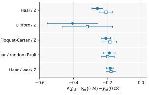
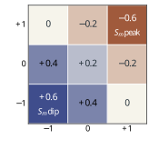
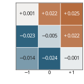
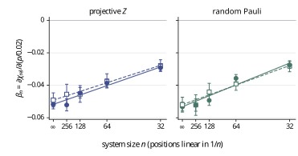
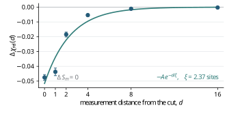
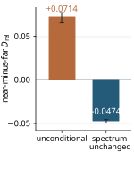

# Beyond the Schmidt Spectrum

## Boundary entangling susceptibility in monitored quantum circuits

This repository asks a deliberately local question:

> If two many-body states have exactly the same complete Schmidt spectrum across a cut, must the next fresh gate crossing that cut generate the same amount of entanglement?

**No.** The central spectrum fixes the entanglement already present across the cut, but it does not fix how the associated Schmidt vectors are embedded near the boundary. In the monitored circuits studied here, that missing spatial information changes systematically with measurement history and controls the response to a fresh cross-cut gate.

The repository is designed to be readable without the manuscript. The shortest route is this page; the full argument is in [`docs/SCIENTIFIC_STORY.md`](docs/SCIENTIFIC_STORY.md).

## Four-step result

### 1. The central spectrum is insufficient

After replacing the central Schmidt eigenvalues by the same reference spectrum while retaining the state-dependent Schmidt vectors, stronger-monitoring states remain less susceptible to the same fresh probe. The result survives five state-generation families and an independent-seed replication.



### 2. The missing information is exact and local

For a fresh Haar-random or uniformly random two-qubit Clifford gate crossing the central cut,

$$
\chi_{\mathrm{rel}}
=\frac{d}{d-1}\left[1-\frac{2}{5}\frac{P_{m-1}+P_{m+1}}{P_m}\right].
$$

The complete central Schmidt spectrum fixes $P_m$, but not the neighboring purities $P_{m-1}$ and $P_{m+1}$.

For stabilizer states, the result reduces to a nine-state boundary alphabet with

$$
\delta_L=S_m-S_{m-1},\qquad
\delta_R=S_m-S_{m+1},
$$

and

$$
\frac{\chi_{\mathrm{rel}}}{d/(d-1)}
=1-\frac{2}{5}\left(2^{\delta_L}+2^{\delta_R}\right).
$$

<p align="center">


</p>

Stronger monitoring shifts probability toward boundary codes in which the central cut is a local entanglement maximum, lowering the exact response.

### 3. The physical effect persists to large size

Pure stabilizer states have flat nonzero Schmidt spectra. Matching states within the same $(n,\tau,S_m)$ stratum therefore fixes the complete central spectrum **without modifying the state**. The fixed-spectrum response remains negative through $n=256$, under both projective-$Z$ and random-Pauli monitoring, and independently replicates.



The extrapolations are consistent with a nonzero negative thermodynamic limit. The repository does not claim a universal finite-size exponent.

### 4. A paired intervention localizes the mechanism

Copies of the same premeasurement stabilizer state are measured at different distances from the cut. On the branch with $\Delta S_m=0$, the complete central spectrum is unchanged. Moving the measurement toward the cut suppresses the next-gate response, with a fitted range of about $2.37$ sites.

<p align="center">


</p>

The causal statement concerns **measurement location on the same pre-state**, conditional on the unchanged-spectrum branch. It is not a randomized causal statement about assigning the long-run monitoring rate $p$.

## Exact, numerical, and extrapolated statements

| Statement | Status |
|---|---|
| Local-twirl response-operator identity | Exact |
| Haar/Clifford neighboring-purity specialization | Exact |
| Stabilizer nine-code response alphabet | Exact |
| Monitoring-dependent boundary-code redistribution | Numerical |
| Persistence through $n=256$ | Numerical |
| Nonzero thermodynamic response | Supported extrapolation |
| Measurement-location effect | Paired conditional intervention |
| New MIPT order parameter or critical exponent | **Not claimed** |

## What this repository does not claim

- The susceptibility is not presented as an order parameter.
- No critical exponent or singularity at the monitored transition is claimed.
- No universal non-Clifford thermodynamic scaling law is claimed.
- The earlier cumulative spectral-flow-cancellation interpretation is rejected; see [`docs/RESEARCH_HISTORY.md`](docs/RESEARCH_HISTORY.md).

## Reader routes

| Goal | Start here |
|---|---|
| Understand the full argument | [`docs/SCIENTIFIC_STORY.md`](docs/SCIENTIFIC_STORY.md) |
| Check the exact identities | [`docs/THEORY.md`](docs/THEORY.md) |
| Inspect numerical methods | [`docs/NUMERICAL_METHODS.md`](docs/NUMERICAL_METHODS.md) |
| Navigate the code | [`docs/CODE_MAP.md`](docs/CODE_MAP.md) |
| Reproduce the six Python panels | [`docs/REPRODUCTION.md`](docs/REPRODUCTION.md) |
| Audit every claim | [`docs/CLAIM_EVIDENCE_MAP.md`](docs/CLAIM_EVIDENCE_MAP.md) |
| See results beyond the Letter | [`docs/EXTENDED_RESULTS.md`](docs/EXTENDED_RESULTS.md) |
| Understand failed earlier directions | [`docs/RESEARCH_HISTORY.md`](docs/RESEARCH_HISTORY.md) |
| Review limitations | [`docs/SCOPE_AND_LIMITATIONS.md`](docs/SCOPE_AND_LIMITATIONS.md) |
| Check migration completeness | [`provenance/MIGRATION_STATUS.md`](provenance/MIGRATION_STATUS.md) |

## Quick start

```bash
python -m venv .venv
source .venv/bin/activate
pip install -r requirements.txt
pip install -e .
python verify.py
python reproduce.py --core-figures
```

The canonical figure inputs are under [`data/processed/core_figures/`](data/processed/core_figures/), the exact plotting scripts are under [`scripts/figures/`](scripts/figures/), and browser-visible SVG exports are under [`figures/core_svg/`](figures/core_svg/). Fresh vector PDFs and PNGs are written locally to `reproduced_figures/`.

## Full research studies

The clean reader-facing layer is accompanied by load-bearing simulation and analysis source, design locks, validation source, and selected derived tables under [`studies/`](studies/). Large compressed trajectory/state archives are intentionally kept outside ordinary Git history and are described in [`docs/DATA_POLICY.md`](docs/DATA_POLICY.md).

## Citation and licensing

A citation record is provided in [`CITATION.cff`](CITATION.cff). No reuse license has yet been selected; see [`LICENSE_PENDING.md`](LICENSE_PENDING.md).
