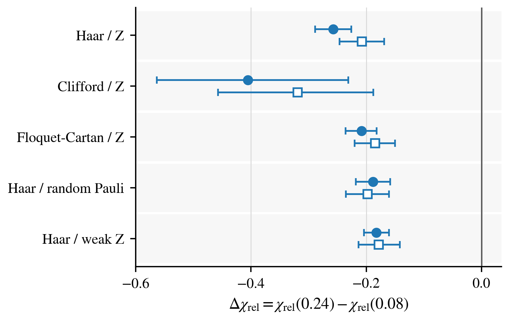
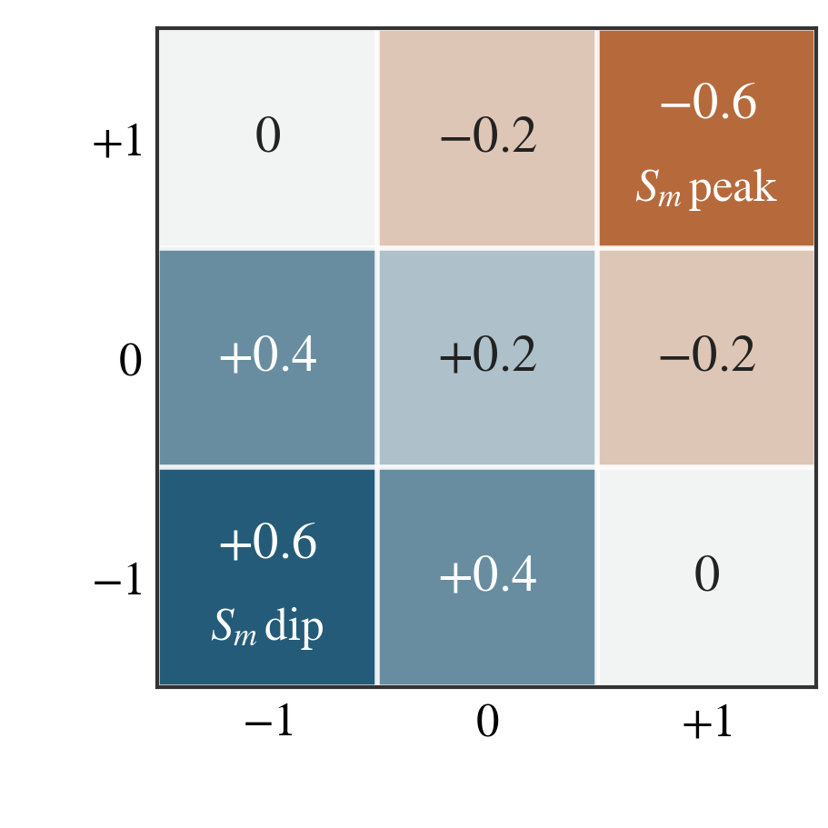
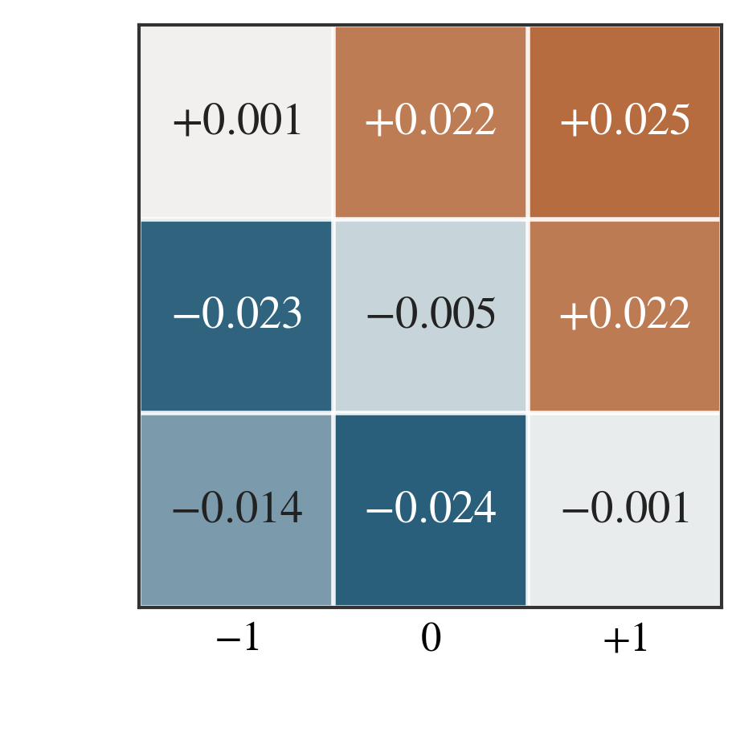
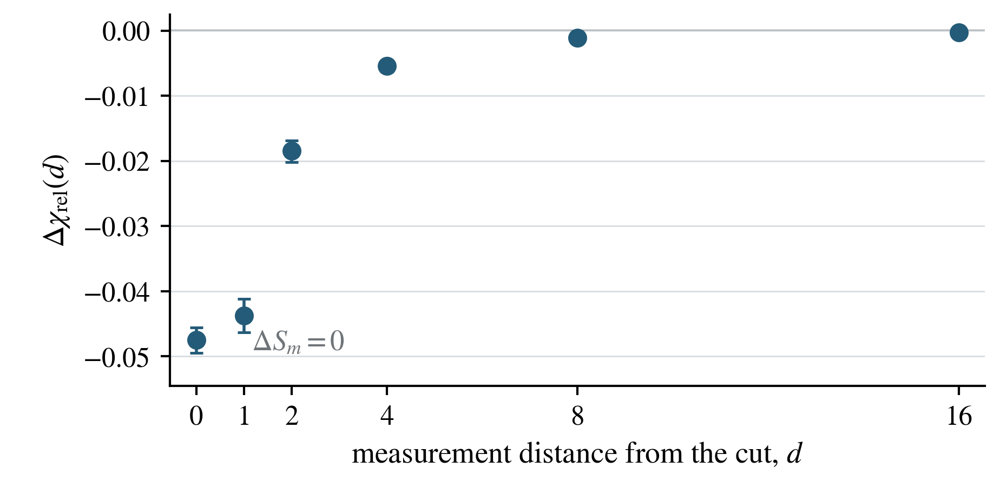

# Beyond the Schmidt Spectrum

## A dialogue on boundary entangling susceptibility

**Working report · 5 September 2026**

**Central question.** When two many-body states have the same complete Schmidt spectrum across a cut, what determines their response to the next fresh gate crossing that cut?

**Answer in one paragraph.** For the purity-normalized linear-entropy response studied here, the central spectrum is insufficient. A Haar-random or uniformly random two-qubit Clifford probe has an exact response determined by the purities across three adjacent cuts. Monitored circuits change the two neighboring purities even at fixed complete central spectrum. The corresponding monitoring coefficients remain negative through 256 qubits and repeat under independent seeds. A paired measurement-location intervention produces a spectrum-preserving suppression concentrated near the cut. These statements do not require a single-exponential distance law, a rigorously established thermodynamic limit, or a new transition order parameter. [S1–S5]

This report follows the agreed **M1–M9 main-text questions** and **A–H appendix questions**. It contains only the four agreed figures, assembled from the six Python panels. The answers distinguish exact identities, original numerical results, extrapolations, and post-hoc checks. The Figure 4 distance panel uses the approved revision without the exponential curve or its length annotation. Its data and original confidence intervals are unchanged. [S1, S4, S6]

## Reading map

| Main question | Purpose | Figure |
|---|---|---|
| M1–M2 | Identify the information being controlled and define the response | Definitions |
| M3 | Establish the fixed-spectrum contrast | 1 |
| M4–M5 | Identify the exact mechanism and measured redistribution | 2 |
| M6–M7 | Remove spectrum replacement and examine size/replication | 3 |
| M8 | Isolate the measurement-location intervention | 4 |
| M9 | State the surviving conclusion and its limits | Synthesis |

The appendix answers implementation and inference objections in the same order. The questions represent reader perspectives, not quotations or attributed opinions of individual researchers.

# Part I. Main-text questions

## M1. What does the complete Schmidt spectrum tell us, and what might it omit?

**Reader.** If I know every Schmidt eigenvalue, have I not already specified the entanglement across the cut?

**Answer.** You have specified all central bipartite entanglement quantities that depend only on those eigenvalues. For a pure state across the cut $A|B$,

$$
|\psi\rangle=\sum_{\alpha}\sqrt{\lambda_\alpha}
|u_\alpha\rangle_A|v_\alpha\rangle_B,
\qquad \lambda_\alpha\geq0,\quad\sum_\alpha\lambda_\alpha=1.
$$

The list $\{\lambda_\alpha\}$ fixes the central purity, Schmidt rank, and entropies. It does not specify the Schmidt vectors $|u_\alpha\rangle$ and $|v_\alpha\rangle$, or how their degrees of freedom occupy the sites within each half. A gate acting on just the two boundary sites is sensitive to that spatial arrangement. The question is therefore about the **response to a specified local operation**, not a competing definition of the entanglement already present. [S2]

**Reader.** Is insufficiency by itself the main discovery?

**Answer.** No. A small example already makes insufficiency explicit. Across $12|34$, compare $|0000\rangle$ with a Bell pair within sites $12$ and another within $34$. Both have central spectrum $(1,0,0,0)$. Their neighboring-cut purities differ, however, and the exact formula below gives responses $4/15$ and $4/5$. This is an illustration of the identity, not a priority claim. The empirical contribution is that monitored dynamics reorganizes this extra information systematically at fixed spectrum, and that a controlled location intervention reproduces the response suppression. [S2, S7]

**Next question.** Which response makes that distinction both precise and computable?

## M2. What fresh-gate response is tested?

**Reader.** What exactly is measured before and after the probe?

**Answer.** Consider an even open chain with central cut $m=n/2$. Define $D=2^m$ and

$$
P_j=\mathrm{Tr}\,\rho_{[1:j]}^2,
\qquad L_m=\frac{D}{D-1}(1-P_m).
$$

A fresh two-qubit unitary $U$ acts on the central bond, independently of the gates that generated the state. The response and its purity-normalized version are

$$
\chi_2=\mathbb E_U[L'_m-L_m]
=\frac{D}{D-1}(P_m-\mathbb E_U P'_m),
\qquad
\chi_{\mathrm{rel}}=\frac{\chi_2}{P_m}.
$$

The main probe ensemble is Haar $U(4)$, or the uniform two-qubit Clifford ensemble, which gives the same two-copy average. The expectation is evaluated using an exact identity rather than estimating it from a finite sample of fresh gates. Positive response means an average increase in normalized linear entropy; negative response means an average decrease. A negative **contrast or monitoring coefficient** means a lower response in one ensemble, not necessarily a negative response for every state. [S2, S3]

**Reader.** Why divide by purity, and why not call this the Rényi-2 entropy change?

**Answer.** Division by $P_m$ separates the relative response from the input purity scale. It is useful when ranks vary with size, because purity can become small. The unnormalized $\chi_2$ remains a secondary outcome. This quantity is not generally

$$
\mathbb E_U[-\log_2 P'_m]+\log_2 P_m.
$$

The average of a logarithm is not the logarithm of an average, and the response here is linear in purity. We retain the established symbol, but use **purity-normalized linear-entropy response** as the precise description. It is a finite-gate response, not an infinitesimal derivative with respect to gate strength. [S3, S4]

**Next question.** Does a monitoring-dependent difference remain when the complete central spectrum is actually controlled?

## M3. At the same complete central spectrum, does monitoring history still matter?

**Reader.** How do you separate eigenvalue effects from the remaining state structure?

**Answer.** In the diagnostic intervention, the leading Schmidt-vector pairs of each eligible state are retained while the eigenvalues are replaced by a shared rank-4 reference spectrum. That reference is constructed from discovery trajectories, separately within each state-generation family, size, and probe time, then used in the held-out comparison. Thus “same spectrum” is exact within the declared comparison cell; it is not a claim that every plotted family and size has one universal reference spectrum. [S6, S8]

The displayed endpoint is

$$
\Delta\chi_{\mathrm{rel}}
=\chi_{\mathrm{rel}}(p=0.24)-\chi_{\mathrm{rel}}(p=0.08).
$$

The comparison averages the supported size/time cell contrasts, using $n=10,12,14$ and $\tau=6,8$. Five circuit/measurement families are tested: Haar/projective Z, Clifford/projective Z, Floquet-Cartan/projective Z, Haar/random Pauli, and Haar/weak Z. The primary and independent-seed estimates are all negative, with all ten plotted 95% intervals below zero. The Clifford row uses four supported cells rather than the six available for the other families. [S1, S6, S8]



**Figure 1. Complete central-spectrum control leaves a response difference.** Filled circles are the held-out primary run; open squares are the independent-seed run. Bars are the adopted nominal pointwise 95% percentile intervals from 50,000 valid support-conditioned trajectory-cluster draws per contrast. Whole trajectories retain their time records and rank-eligibility masks; entire proposals with any empty required cell are rejected. The primary pool is the union of trajectories with an eligible retained row. Reference spectra and observed support are fixed. See [the complete recipe and limitations](FIGURE1_UNCERTAINTY.md). The eigenvalues are equalized within comparison cells, while the retained Schmidt vectors remain state-dependent. This is a diagnostic spectrum replacement, not an experimentally proposed operation. [S1, S6]

**Reader.** What does the plot establish, and what does it not establish?

**Answer.** It supports a systematic fixed-spectrum difference in the tested finite systems. It does not show a causal effect of assigning the long-run monitoring rate after conditioning or intervention, and it does not establish a generic non-Clifford thermodynamic law. Spectrum replacement is deliberately artificial. Its possible role is addressed by the physically generated stabilizer states in Figure 3. [S4, S8]

**Next question.** Can the response difference be explained by identifiable state information rather than a vague appeal to Schmidt vectors?

## M4. What missing state information controls the response?

**Reader.** What does the exact calculation require beyond the central spectrum?

**Answer.** Write the local partition as $La|bR$, with $a,b$ the two qubits on which the probe acts. The two-copy Haar average gives

$$
\mathbb E_U P'_m=\frac25(P_{m-1}+P_{m+1}).
$$

Consequently,

$$
\boxed{\chi_{\mathrm{rel}}=
\frac{D}{D-1}\left[1-\frac25
\frac{P_{m-1}+P_{m+1}}{P_m}\right].}
$$

This identity holds for every pure input state under the stated probe ensemble. No stabilizer assumption enters it. The complete central spectrum fixes $P_m$, but it does not fix the two neighboring-cut purities. At fixed $P_m$, a larger neighboring-purity sum gives a lower response. That is the exact state information through which the measured effect operates. The identity does not, by itself, predict the direction in which monitoring changes those purities. [S2]

**Reader.** Does “neighboring-cut” mean that a few physical sites determine the answer?

**Answer.** No. These purities are associated with extended bipartitions whose cut positions are adjacent. They are not merely observables of a two-site reduced density matrix. The probe is local; the information relevant to its averaged entangling response can involve how the boundary sites are entangled with the interiors. Exact sufficiency of three cut purities must not be confused with a theorem about reconstructing the response from a bounded physical window. [S2, S4]

**Next question.** How does monitoring change these exact response coordinates in the physical ensemble?

## M5. How does monitoring reorganize that information?

**Reader.** Can the mechanism be made more explicit than three real-valued purities?

**Answer.** For a pure stabilizer state, $P_j=2^{-S_j}$, where $S_j$ is the integer entropy in bits. Define

$$
\delta_L=S_m-S_{m-1},\qquad
\delta_R=S_m-S_{m+1}.
$$

Moving a cut by one qubit changes its entropy by at most one bit, so each increment lies in $\{-1,0,+1\}$. The ordered pair is the boundary code. There are nine codes, but only six distinct response values:

$$
r(\delta_L,\delta_R)
=\frac{\chi_{\mathrm{rel}}}{D/(D-1)}
=1-\frac25(2^{\delta_L}+2^{\delta_R}).
$$

A central local entropy minimum, code $(-1,-1)$, has $r=+0.6$; a central local maximum, code $(+1,+1)$, has $r=-0.6$. The two matrices compare this exact response alphabet with an observed redistribution of code probabilities. [S2, S1]

<p align="center">


</p>

**Figure 2. Exact response values and measured boundary-code redistribution.** Rows are $\delta_L=+1,0,-1$ and columns are $\delta_R=-1,0,+1$. The left matrix is exact after removing the finite-size factor $D/(D-1)$. The right matrix shows the primary projective-Z probability slopes per $\Delta p=0.02$ at $n=256$, estimated with the same fixed-spectrum controls. Their response-weighted sum reconstructs the direct monitoring coefficient, approximately $-0.0521300$. Displayed matrix values are rounded; the canonical table retains more digits. [S1, S2]

**Reader.** Is the reconstruction an additional independent observation?

**Answer.** It is an exact decomposition and a consistency check, not a statistically independent experiment. Because the response is a fixed function of the code, its conditional mean is a probability-weighted sum of code responses. Applying the same linear regression operation to the response and the code indicators preserves that identity. The empirical content is the direction and size of the probability redistribution. In the displayed cell, increased weight moves toward low-response codes and away from high-response codes. [S2, S5]

**Next question.** Is this mechanism visible in physical states without replacing their central eigenvalues?

## M6. Could spectrum replacement itself create the effect?

**Reader.** Figure 1 uses an artificial intervention. What is the physical comparison?

**Answer.** A stabilizer reduced density matrix has $2^{S_m}$ equal nonzero eigenvalues, each $2^{-S_m}$, and all other eigenvalues zero. At fixed $n$, equality of $S_m$ therefore fixes the complete central spectrum, including its rank and multiplicities. Naturally generated monitored stabilizer states can be compared within fixed $(n,\tau,S_m)$ strata without altering any state. [S2, S3]

This changes the evidence, not the question. Figure 1 controls eigenvalues by replacement and tests multiple finite circuit families. Figure 3 controls them by selecting physically generated states with identical stabilizer spectra and reaches much larger sizes. These are complementary constructions. Their effect sizes need not coincide because their states, monitoring grids, and estimands differ. [S1, S3, S8]

**Reader.** Does exact matching make the monitoring-rate comparison causal?

**Answer.** No. Central entropy is a post-dynamics variable. Conditioning on it selects a population that can depend on monitoring rate. The result is a conditional response contrast: states in the same declared spectrum stratum still show a monitoring-associated response difference. It is not the unconditional effect of randomly assigning a different long-run $p$. The separate location intervention in Figure 4 addresses a more narrowly controlled causal question. [S3, S4]

**Next question.** Does the physical fixed-spectrum difference survive larger systems and new random seeds?

## M7. Does the physical effect persist at large size and independently replicate?

**Reader.** What is plotted as the system size increases?

**Answer.** For each size and monitoring protocol, a regression controls $(\tau,S_m)$ and estimates the coefficient of $(p-0.26)/0.02$. The plotted $\beta_n$ is that within-spectrum monitoring coefficient. Although the axis uses derivative notation, the numerical estimate is a pooled linear coefficient on the observed common support, not a separately measured derivative at every rate. [S3, S4]

The primary simulation contains 57,600 trajectories; the disjoint-seed run contains 21,600. Both use $n=32,64,128,256$, three late probe times, and projective-Z or random-Pauli monitoring. All 16 finite-size estimates and their plotted intervals are negative. An independently written stored-row replay reproduces these coefficients from 237,600 state records to numerical precision. [S1, S3, S4]


**Figure 3. Physical fixed-spectrum monitoring coefficients persist through 256 qubits.** Filled circles/solid lines are the primary run; open squares/dashed lines are the independent-seed run. Finite-size points are direct estimates, with original trajectory-bootstrap intervals. Lines and points at infinity use the locked model $\beta_n=\beta_\infty+a/n$. Their intervals do not include every possible finite-size-model uncertainty. Tick positions are linear in $1/n$. [S1, S3, S4]

**Reader.** How strong is the evidence for a nonzero thermodynamic limit?

**Answer.** The four locked intercepts lie approximately between $-0.0532$ and $-0.0492$, with intervals below zero. A specified post-hoc menu of 32 alternative fixed-power and leave-one-size-out fits also retains negative intervals. But the primary random-Pauli series has appreciable residuals under the locked model, and the spectrum strata and their weights can change with size. The finite-size observations are more direct than the limiting inference. The evidence supports a negative extrapolated sign under the checked assumptions, not a rigorous limit or a universal correction law. [S1, S4]

**Reader.** Is the replication independent in every sense?

**Answer.** The simulation seeds are disjoint, and the measurement basis is varied. That is independent-seed replication and ensemble robustness. It is not an independently developed large-system simulator or an external group's replication. The separate state-vector comparison and independently written analysis replay test different parts of the evidence chain without replacing that distinction. [S3, S4, S7]

**Next question.** Can one controlled measurement-location change reproduce the response suppression while preserving the spectrum?

## M8. Can a single measurement cause the fixed-spectrum suppression, and how local is it?

**Reader.** What exactly is paired in Figure 4?

**Answer.** Each premeasurement stabilizer state is copied in simulation. One projective-Z measurement is applied at a chosen distance from the central cut on each copy. The averaged fresh-probe response is computed before and after that measurement. The distance profile plots the measurement-induced change

$$
\Delta\chi_{\mathrm{rel}}(d)
=\chi_{\mathrm{rel}}(\text{postmeasurement at }d)
-\chi_{\mathrm{rel}}(\text{premeasurement}).
$$

It is not itself the difference from a far measurement. The right panel instead forms the paired difference $D_{\mathrm{rel}}=\Delta\chi_{\mathrm{rel}}^{\mathrm{near}}-\Delta\chi_{\mathrm{rel}}^{\mathrm{far}}$, with near distance zero and eligible far distances at least $n/4$. The nine $(n,p)$ cells are weighted equally. [S3, S4]

<p align="center">


</p>

**Figure 4. A paired location intervention isolates a near-cut-concentrated response.** Left: original conditional distance means and original 95% trajectory-bootstrap intervals, retaining interventions with $\Delta S_m=0$. No fitted distance law is shown. Right: original near-minus-far estimates, $+0.0714$ unconditionally and $-0.0474$ with spectrum preservation. Measurement location is controlled on copies of the same pre-state; the conditional estimand depends on the stated eligibility rule. The complete rules and stricter checks are in Appendix F. [S1, S3, S4]

**Reader.** Could different eligible states or sides at each distance create the profile?

**Answer.** The original analysis can retain different sides at near and far locations. A post-hoc check therefore fixes the side and pre-state and requires both the $d=0$ and $d=n/4$ interventions to preserve the spectrum. It gives $-0.047474$ with fresh 95% interval $[-0.049338,-0.045470]$, close to the original conditional estimate. A second check fixes eligibility across all six displayed distances. That common-sample curve still concentrates the effect near the cut: at four sites its magnitude is 11.95% of the adjacent-cut value, and at eight sites 1.65%. These are new selected-population checks, not replacements for the original plotted endpoints. [S4]

**Reader.** Then is the decay exponential with length 2.37 sites?

**Answer.** That interpretation is not supported by the fit diagnostics. The historical fit's parameter interval described resampling variation inside a chosen exponential model; it did not establish that the model fits adequately. Covariance-aware and cell/window diagnostics show substantial mismatch, including for the common-eligibility profile. The approved figure therefore removes the curve and length annotation while preserving every data point and original interval. The surviving statement is strong attenuation over the measured distances, not a precise physical localization length or strict finite-range theorem. [S4]

**Next question.** What single conclusion can the four figures support together?

## M9. What is the narrow final conclusion, and what is not claimed?

**Reader.** What should remain after all the qualifications?

**Answer.** The complete central Schmidt spectrum does not determine the stated fresh-gate response. The exact neighboring-purity identity identifies the extra state information; monitored dynamics reorganizes it within fixed-spectrum comparisons; the corresponding coefficients persist through 256 qubits and repeat under disjoint seeds; a controlled paired location intervention produces a spectrum-preserving suppression concentrated near the cut. That is the four-figure chain. [S1–S5]

The results do not establish a new monitored-transition order parameter, a critical exponent, a universal generic non-Clifford thermodynamic law, or an unconditional causal effect of the long-run monitoring rate. The exponential fit is not a physical conclusion. “Exact,” “independently replicated,” and “local” apply to specific parts of the argument, not indiscriminately to the whole project. [S2–S5]

The exact formula is the mechanism; the monitored-state redistribution is the empirical discovery; physical spectrum matching and paired intervention answer different objections. The limiting extrapolation and the transition context strengthen interpretation only within their declared assumptions. There is no need to restore the earlier cumulative flow-balance framing. [S4, S5]

# Part II. Appendix questions

## A. Definitions and conventions

### A1. What precisely are $P_j$, $\chi_2$, and $\chi_{\mathrm{rel}}$?

**Reader.** Which spectrum and entropy conventions are being used?

**Answer.** The $\lambda_\alpha$ are reduced-state eigenvalues, hence the squared Schmidt amplitudes. For a pure chain state, $P_j$ is the purity of sites $1,\ldots,j$, equal to the complementary purity. $\chi_2$ is the expected change in the normalized linear entropy of the central half-chain. $\chi_{\mathrm{rel}}=\chi_2/P_m$ uses the input, not post-probe, central purity. For stabilizer states, $S_j$ is the von Neumann entropy in bits; flat spectra also make the Rényi entropies equal to $S_j$. This equality for stabilizer entropies does not turn the average purity response into an average logarithmic entropy increment. We use $D$ for half-chain dimension and $d$ for measurement distance. [S2, S3, S4]

### A2. What is the complete-cycle convention for monitoring probability $p$?

**Answer.** In the large-size arm, a cycle contains both nearest-neighbor brickwork sublayers followed by independent monitoring of each site with probability $p$. The sublayer order is randomized in that arm. Probe time is $\tau=\text{cycles}/n$. Projective-Z monitoring measures Z; random-Pauli monitoring chooses X, Y, or Z independently at each selected site. The numerical $p$ is not directly interchangeable with a convention that monitors after each sublayer. The finite state-vector intervention has its own recorded gate scheduling, so the two simulation arms should not be described as literally identical dynamics. [S3, S8]

## B. Central-spectrum intervention

### B1. How is the common spectrum constructed without confirmatory leakage?

**Answer.** The primary state-vector run splits trajectory indices 0–11 into discovery and 12–23 into confirmation. For each family, size, and time, discovery states with rank at least four contribute their leading four eigenvalues, normalized within each state. Those vectors are averaged and renormalized to define the target. Discovery observations from the monitoring grid are pooled for this construction; the target is then held fixed across rates within that cell. The independent-seed run uses an 8/8 discovery/confirmation split and constructs its own references. Held-out confirmation prevents direct reuse of confirmatory outcomes in the reference construction, but it is not public preregistration or independent analyst blinding. [S8]

### B2. What is retained after equalization?

**Answer.** The intervention uses the original state's leading left and right Schmidt vectors and replaces their weights by the target weights. Components beyond the selected rank are discarded. It therefore retains the chosen leading vectors, not the full original state or every original Schmidt component. Equalization is applied only to rank-supported states. A singular-value decomposition chooses a basis within degenerate subspaces; retaining that numerical choice should not be described as a unique basis-independent physical operation. This is one reason the physically generated exact-spectrum arm is needed. [S8]

### B3. Does the effect depend on intervention rank?

**Answer.** The locked main diagnostic uses rank four. The archive contains an explicitly post-hoc rank-two check motivated by limited rank-four support in strongly monitored Clifford trajectories; its reported pooled architecture/probe intervals remain negative. That supports the sign beyond the original rank threshold, without making the rank-two population identical to the rank-four population. Broader rank checks are supporting material, not an assertion that every possible target rank and spectrum produces the same response shift. [S8]

### B4. Does it survive other probes and state-generation families?

**Answer.** The five state-generation families in Figure 1 separate changes of unitary dynamics, measurement basis, and measurement strength. The checkpoint also tests two locally dressed Cartan probes alongside the Haar/Clifford two-design probe. Their reported rank-four pooled contrasts are negative. Those checkpoint tables principally report $\chi_2$, whereas Figure 1 reports $\chi_{\mathrm{rel}}$; their magnitudes must not be interchanged. The general four-purity identity explains how changing the probe changes the coefficients. It does not imply a negative monitoring contrast for every arbitrary gate ensemble and every possible input distribution. [S2, S8]

### B5. Why can the unmatched physical trend have the opposite sign?

**Answer.** Without spectrum control, stronger monitoring changes both the central purity and the neighboring structure. The checkpoint's unnormalized physical-state endpoint is positive in the tested families, while the equalized endpoint is negative. The exact formula allows such a reversal because the central and neighboring terms compete. Describing the first effect as additional entanglement-generation “headroom” is useful intuition, not a separate operational resource measure. Equalization isolates a different comparison; subtracting the two pooled trends is not automatically a causal mediation analysis. [S2, S8]

## C. Exact response theorem

### C1. How is the neighboring-cut identity derived using swaps?

**Answer.** In two copies, let $F_X$ swap region $X$. Purity is $P_X=\mathrm{Tr}(\rho^{\otimes2}F_X)$. A probe on $ab$ changes the central swap $F_LF_a$ only through $F_a$. Haar averaging on the four-dimensional space $ab$ projects the response operator onto $I$ and the full swap $F_{ab}$:

$$
\Omega=\mathbb E_U U^{\dagger\otimes2}F_aU^{\otimes2}
=\alpha I+\beta F_{ab}.
$$

Both $\mathrm{Tr}(F_a)$ and $\mathrm{Tr}(F_aF_{ab})$ are eight. Since $\mathrm{Tr}I=16$ and $\mathrm{Tr}F_{ab}=4$, trace preservation gives $16\alpha+4\beta=8$ and $4\alpha+16\beta=8$. Thus $\alpha=\beta=2/5$. Multiplying by $F_L$ yields the purities of $L$ and $Lab$, which are the cuts $m-1$ and $m+1$. A two-design gives the same two-copy average. This is the explicit Haar specialization of the response-operator derivation in the source. [S2]

### C2. What is the response-operator theorem for a general gate ensemble?

**Answer.** For any probability ensemble $\mathcal E$, define $\Omega_{\mathcal E}=\mathbb E_U U^{\dagger\otimes2}F_aU^{\otimes2}$. Then

$$
\mathbb E_U P'_{La}=\mathrm{Tr}\!\left[\rho^{\otimes2}
(F_L\otimes\Omega_{\mathcal E}\otimes I_R)\right].
$$

This follows from the purity swap identity and cyclicity of the trace. It is not a claim that every ensemble reduces to three cut purities. Without the corresponding symmetry, the operator can retain more information. The simple neighboring-cut form belongs to the Haar/two-design specialization. [S2]

### C3. How does it specialize to locally dressed fixed entanglers?

**Answer.** For $U=(u_a\otimes u_b)V(v_a\otimes v_b)$ with independent local Haar dressing, the output rotations cancel from the swap response and the input twirl projects onto $I,F_a,F_b,F_aF_b$. Therefore

$$
\mathbb E P'_{La}=c_IP_L+c_aP_{La}+c_bP_{L\cup b}+c_{ab}P_R.
$$

The last term uses global purity. The additional $P_{L\cup b}$ is noncontiguous. In the normalization used by the source,

$$
(c_I,c_a,c_b,c_{ab})=
\left(\frac23e_p,\ 1-g_t-\frac56e_p,\ g_t-\frac56e_p,\ \frac23e_p\right).
$$

Here $e_p$ and $g_t$ are the source's normalized entangling power and gate typicality. Their conventions are given in the theory document; inserting definitions from another normalization can change these coefficients. The source lists $(2/5,0,0,2/5)$ for the Haar/two-design case, $(1/3,1/4,-1/12,1/3)$ for the dressed XY probe, and $(4/9,1/9,-2/9,4/9)$ for the dressed XX probe. Negative coefficients are allowed: this is an operator decomposition, not a convex mixture of subsystem purities. [S2]

### C4. How were the coefficients checked?

**Answer.** The original checkpoint compared direct commutant projection with the gate-invariant expression on 100 Haar-random two-qubit gates, with maximum coefficient discrepancy about $1.17\times10^{-15}$. The takeover review reports a separately written projection check with discrepancy about $1.11\times10^{-15}$ and direct averaging over the supplied 11,520-element Clifford bank on 12 four-qubit inputs. These are numerical checks of implementations and identities, not proofs of absolute novelty or external specialist review. The algebraic derivation and the assumptions remain the basis of the exact claim. [S2, S7]

## D. Stabilizer spectra and boundary codes

### D1. Why does fixing $S_m$ fix the complete stabilizer spectrum?

**Answer.** A stabilizer reduced state is proportional to a projector. At entropy $S_m$ its rank is $2^{S_m}$, and each nonzero eigenvalue equals $2^{-S_m}$. At fixed subsystem dimension this specifies the whole eigenvalue list, including zeros. For generic non-stabilizer states, equal entropy does not fix the spectrum; the exact matching argument must not be transferred to them. [S2]

### D2. Why are the boundary increments restricted to $\{-1,0,+1\}$?

**Answer.** The entropy difference between adjacent cuts is bounded in magnitude by the entropy of the intervening qubit, at most one bit. Stabilizer entropies are integer valued. Combining these facts gives the three allowed values for each increment. Nine ordered pairs are available to the global description, although particular central ranks or small geometries can restrict which codes occur in a given stratum. Nine codes do not mean nine independent response values or nine independent tests. [S2]

### D3. Does the code distribution reconstruct the full response?

**Answer.** For the stated probe and stabilizer inputs, yes. With $q_p(b\mid n,\tau,S_m)$ the conditional code distribution,

$$
\mathbb E[\chi_{\mathrm{rel}}\mid n,\tau,S_m,p]
=\sum_b q_p(b\mid n,\tau,S_m)\,r_n(b),
\quad r_n(b)=\frac{D}{D-1}r(b).
$$

A linear fixed-effect coefficient has the same weighted decomposition when it is applied to the response and all code indicators using identical observations and weights. Probability-slope conservation is an additional consistency requirement. Machine-precision agreement belongs to full-precision calculations; sums formed from the rounded matrix labels will not reproduce that precision. [S2, S5]

### D4. Is the redistribution robust to protocol, time, and seed?

**Answer.** The exact code identity is unchanged under those choices. The archive reports decompositions under both monitoring bases and both seeds, and late-time response-coefficient checks. Figure 2 deliberately displays one representative decomposition rather than multiple nearly redundant matrices. The response sign's robustness does not require every individual code probability slope to have the same sign or statistical significance in every cell. We treat the time/protocol tables as supporting checks, not a guarantee for arbitrary times and ensembles. [S5, S9]

## E. Physical matching and large-size inference

### E1. What observations enter each $(n,\tau,S_m)$ stratum?

**Answer.** Each observation is a stored state at a selected late time on a simulated trajectory. Analyses are separate for each run, protocol, and size. A stratum is eligible when at least three monitoring levels each supply ten or more records. A trajectory can supply states at multiple times, so those rows are not independent. The primary run has 172,800 stored records and the replication 64,800, but fewer records survive the support rules for a particular fitted coefficient. [S3, S4]

### E2. Could conditioning on $S_m$ create a spurious trend?

**Answer.** It can select different subsets as $p$ changes. That matters for a causal interpretation of assigned monitoring probability. It does not invalidate the narrower observation that conditional ensembles with the same spectrum have different response means, provided the observations, support, and estimator are correctly identified. At $n=256$, no single stratum spans the whole probability grid. The coefficient combines overlapping comparisons, rather than comparing the two extreme rates within one universal rank stratum. Changes in those weights with $n$ are a substantive limitation on thermodynamic interpretation. [S3, S4]

### E3. How is trajectory dependence handled statistically?

**Answer.** The fitted model is

$$
y_i=\alpha_{\tau_i,S_{m,i}}+\beta_n x_i+\varepsilon_i,
\qquad x_i=(p_i-0.26)/0.02.
$$

Within-stratum demeaning gives

$$
\widehat\beta_n=
\frac{\sum_i(x_i-\bar x_{s(i)})(y_i-\bar y_{s(i)})}
{\sum_i(x_i-\bar x_{s(i)})^2}.
$$

The original uncertainty calculation clusters by trajectory and bootstraps trajectories within monitoring-rate cells, preserving their time records together. Eligibility is frozen from the observed support for that analysis. These intervals describe sampling uncertainty conditional on that rule. The evidence reassessment implements the coefficient independently and reproduces all 16 relative-response estimates; it does not independently regenerate the entire finite-size bootstrap campaign. [S3, S4]

### E4. How sensitive is the extrapolated sign to the finite-size model?

**Answer.** The locked model fixes the correction to $1/n$ rather than fitting an exponent. The reassessment reports all tested correction powers $0.5,1,1.5,2$ and all leave-one-size-out $1/n$ fits. The 32 sensitivity intervals and four locked intervals remain negative. However, the primary random-Pauli locked fit has a quadratic residual diagnostic of 16.78 for two nominal residual dimensions. An interval for an intercept conditional on a model does not certify model adequacy. The checked point-intercept range, roughly $[-0.0665,-0.0445]$, is not a confidence interval or a bound over every admissible finite-size behavior. [S4]

### E5. Does the unnormalized response also persist?

**Answer.** The archived large-size analysis retains $\chi_2$ as a secondary outcome and reports negative finite-size coefficients and negative locked limiting coefficients. For example, the primary projective-Z unnormalized intercept is approximately $-0.009580$, with archived interval $[-0.010444,-0.008705]$. This addresses a concern that the observed sign arises only from dividing by purity. It does not remove support selection or model uncertainty. In addition, different purity strata weight the unnormalized and normalized regressions differently, so one pooled coefficient cannot be obtained from the other by multiplying by a single average purity. [S3, S9]

### E6. How closely does the independent run reproduce the primary estimates?

**Answer.** The key replicated feature is the negative within-spectrum coefficient across the tested sizes and protocols. Exact equality is not expected. At $n=256$ under projective Z, for example, the primary value is $-0.052130$ and the replication is $-0.045509$; both original intervals are below zero. Their supported samples differ because the smaller replication has different realized rank counts. Replication therefore supports stability under new seeds, not proof that all finite-sample differences are negligible or that systematic simulator errors are impossible. [S1, S3]

## F. Paired measurement-location intervention

### F1. What is paired, and what variable is intervened on?

**Answer.** The intervention starts from 5,400 sampled premeasurement stabilizer states over $n=64,128,256$ and $p=0.20,0.26,0.34$, with 600 trajectories per cell at $\tau=10$. Alternative locations are evaluated on copies of each pre-state, producing 75,600 geometrically valid records. Distance zero means a site adjacent to the central cut. The intervention changes location, not the earlier circuit history. In the original conditional endpoint, eligible sides are averaged per distance and then eligible far distances are averaged before subtraction from the near mean. A trajectory is retained only when both near and far means exist. [S3, S4]

### F2. How are outcomes sampled and weighted?

**Answer.** In a pure stabilizer state, the random outcomes of a projective Pauli measurement differ by stabilizer signs but give the same phase-free support update and therefore the same entropy/purity endpoints used here. Deterministic measurements do not change that support. The simulator can consequently evaluate these endpoints without storing random signs. This is exact for the listed observables, not a claim that arbitrary measurements or sign-sensitive observables can ignore outcomes. Eligible side means are formed within pre-states, then cell means are weighted equally. Bootstrap draws resample pre-states rather than treating the many counterfactual locations or sides as independent samples. [S3, S4]

### F3. Why does $\Delta S_m=0$ imply an unchanged complete spectrum?

**Answer.** Both pre- and postmeasurement states are pure stabilizer states. Their spectra at the central cut are flat on their nonzero support. Equal $S_m$ means equal rank and equal nonzero eigenvalues at the same dimension. The condition preserves the spectrum, not necessarily the central reduced density matrix or the Schmidt basis. Precisely those unfixed spatial degrees of freedom can alter neighboring purities and the next-probe response. [S2, S3]

### F4. Could branch conditioning explain the result?

**Answer.** The conditional estimand is genuinely selected, and the selection should be specified rather than dismissed. The original rule can retain different sides at different distances. The stricter same-side check compares $d=0$ with $d=n/4$ and requires both potential interventions to preserve the spectrum, retaining 7,945 side pairs in 4,786 pre-states. Its estimate and fresh interval remain negative. A separate all-six-distance eligibility rule retains 6,008 side/pre-state combinations in 4,025 pre-states and still yields a strongly attenuating profile. Neither check identifies an unconditional population effect. Together they show that the qualitative result does not disappear when pairing and eligibility are tightened in these specified ways. [S4]

### F5. Does the distance profile justify a physical localization length?

**Answer.** The earlier appendix plan asked whether the fitted length was robust. The reassessment changes the answer: a physical length inferred from an adequate single-exponential law has not been established. The historical unweighted fit gave $\xi=2.372$, but its predictions fall outside all six pointwise intervals. That observation alone is not six independent hypothesis tests. Covariance-aware fits give residual diagnostics $Q=140.59$ for the original profile and $Q=94.45$ for the common-eligibility profile, each with four nominal residual dimensions. No exact chi-square p-value is assigned. [S4]

The model-free summary is preferable. In the common-eligibility sample, the magnitude ratios at four and eight sites are 11.95% and 1.65%, with fresh intervals 9.54%–14.52% and 0.89%–2.51%. These are jointly bootstrapped ratios of pooled means. The simultaneous six-distance band includes zero at $d=16$; sparse tail events prevent a strong asymptotic-distance claim. Figure 4 therefore shows the original observations without a replacement fitted function. [S4]

## G. Relation to the monitored transition

### G1. Where is the transition in this circuit convention?

**Answer.** The source uses tripartite information of contiguous quarter partitions, not the new response, to locate crossings between system sizes. The high-size crossing is near $p=0.27$ in the complete-cycle convention. It is a numerical contextual estimate, not an exact critical probability. This report does not add a fifth main figure for it or use that estimate to choose the primary response endpoint. [S3, S9]

### G2. Does the response vanish or change sign at the transition?

**Answer.** The relevant tested conditional monitoring coefficients remain negative on both sides. That is a statement about response-versus-monitoring trends, not a claim that every individual state's susceptibility is negative. The observed behavior does not provide the proposed diagnostic with a vanishing phase or establish an order-parameter interpretation. We do not claim a singularity or a critical exponent. [S9]

### G3. What changes across the transition?

**Answer.** The archived secondary hinge analysis at $p=0.27$ finds a weaker magnitude of the negative coefficient above the crossing. For primary projective Z at $n=256$, the estimated slopes per $\Delta p=0.02$ are approximately $-0.11227$ below and $-0.03851$ above. This is consistent with transition-sensitive microscopic organization. Because the hinge analysis is secondary and its breakpoint comes from the contextual crossing, it must not be presented as an independently preregistered critical law or as a substitute for the primary overlap-based coefficient. [S3, S9]

## H. Scope and validation

### H1. Which statements are exact, numerical, extrapolated, or excluded?

| Statement | Evidential category |
|---|---|
| Two-copy response identity and Haar neighboring-purity formula | Exact under stated assumptions |
| Flat stabilizer spectra and finite boundary-code reduction | Exact |
| Monitoring-associated code redistribution | Numerical, conditional on support |
| Negative coefficients through $n=256$ | Direct finite-size evidence |
| Disjoint-seed repeat | Independent-seed replication, not external replication |
| Limiting negative coefficient | Model-dependent extrapolation |
| Paired location contrast | Controlled potential interventions in a selected population |
| Single-exponential physical length, hard finite range, new order parameter | Not established or not claimed |

**Answer.** These categories should remain visible in the report, repository, and eventual paper. A theorem about the response functional cannot establish the sign of every ensemble trend; a green software workflow cannot independently validate every simulation assumption; and a narrow fitted interval cannot establish an extrapolation model. [S2–S5]

### H2. What simulator and package checks were performed?

**Answer.** The supplied phase-free tableau implementation was compared with a direct state-vector implementation for $n=4,6,8,10$, both monitoring protocols, four probabilities, four trajectories, and two times: 256 recorded comparisons agreed for the tested entropy/response quantities. The takeover reran that supplied cross-validation and separately checked the response projection and Clifford average. The evidence pass independently reconstructed all 16 finite-size coefficients and the original location endpoints from stored records. These are complementary checks with different failure modes. They do not constitute a new full large-system campaign or an external replication. [S3, S4, S7]

At repository level, tests check exact-identity examples, a synthetic within-stratum regression with a known answer, paired bootstrap behavior, rejection of a wrong archive, and complete all-format figure export. The figure pipeline validates six PDF/PNG/SVG triples in fresh temporary output before copying them. This guards against stale missing outputs; it does not turn canonical-table redraws into raw-data reanalysis. The independent evidence command reads the required indexed root record bundle; it no longer requires a separately obtained Checkpoint 05 archive. Current Figure 1 intervals are reproduced by the adopted locked sampler and independently replayed from saved multiplicities. Only the superseded historical interval recipe remains unrecovered; see [the current procedure](FIGURE1_UNCERTAINTY.md). [S4, S5]

### H3. How does the work differ from established related approaches?

**Answer.** The source literature audit credits stabilizer spectrum structure, Clifford designs, two-copy swap methods, entanglement features, and gate entangling-power/typicality descriptions as established ingredients. The intended contribution is their use in a controlled question about monitored state ensembles: full central-spectrum control, a fresh-gate response, an exact neighboring-cut explanation, physical large-size comparison, and a paired location intervention. Elementary insufficiency and the existence of monitored transitions should not be advertised as new. [S2, S10]

This report does not perform a new priority search or certify absolute novelty. The stored literature audit is a record of prior positioning, not proof that no equivalent formulation exists. The four-figure argument should remain intelligible and testable even to a reader who regards the individual algebraic tools as familiar. [S10]

# Source register and reproduction

The source hierarchy is deliberate: current canonical figure tables for plotted numbers; the exact theory for algebraic claims; recorded methods and code for estimands; and the September 5 reassessment for fit limitations and new selected-population checks. Older figure specifications organize the questions but do not override the later evidence reassessment.

**S1. Canonical figure data.** [Core CSV/JSON tables](../data/processed/core_figures/), especially the Figure 1 contrast, Figure 2 code, Figure 3 scaling, and Figure 4 distance/contrast tables. Figure 1 uses the approved 8 September 2026 uncertainty recipe; its historical intervals are preserved separately. Figures 2–4 are unchanged.

**S2. Exact theory.** [Response operator and stabilizer boundary-code theory](THEORY.md). Includes assumptions, local twirling, gate-invariant conventions, and the finite alphabet.

**S3. Methods.** [Numerical methods](NUMERICAL_METHODS.md) and [run history](RUN_HISTORY.md). Includes grids, seeds, support rules, and original uncertainty calculations.

**S4. Evidence reassessment.** [September 5 analysis](EVIDENCE_REASSESSMENT.md), [result tables](../results/evidence_reassessment/), and [independently written replay script](../scripts/analysis/reassess_evidence.py). The source archive is Checkpoint 05, SHA-256 `284a92bfac08af6194cd576ce07c4be90e1e760fcc7b0fc7951eaacd1fa975ce`.

**S5. Repository implementation and claim boundaries.** [Code map](CODE_MAP.md), [claim ledger](../results/core_claims.csv), [reproduction guide](REPRODUCTION.md), and [tests](../tests/).

**S6. Figure/question design record.** The retained specifications are in [studies/figure_design](../studies/figure_design/); figure-specific resamples are indexed in the root [record bundle](../data/record_bundle_manifest.json). The preserved `entanglement_prl_figure_design_checkpoint_01/MAIN_APPENDIX_QUESTION_MAP.md` and Figure 1 specification supply the question identifiers and original contrast definition. The adopted question map is included with this report as [DIALOGUE_QUESTION_MAP.md](DIALOGUE_QUESTION_MAP.md). Historical Figure 4 fit language is superseded.

**S7. Takeover checks.** The cited original-study check scripts and results are preserved under `takeover_review/` in the root record bundle, materialized by `materialize_studies.py`. The author-facing `Boundary-Entangling-Susceptibility-takeover-review-2026-09-05.zip` records the separately written checks. These are author-side numerical checks, not an external audit. Its provenance remains separate from the original primary simulations.

**S8. Finite intervention source.** [Checkpoint 04 study](../studies/checkpoint_04/), particularly `scripts/cross_architecture_simulation.py`, plus the preserved full Checkpoint 04 archive, SHA-256 `690722855b37c5ba1aab96720e03d0f36e7b2b0b86447827f9eeecda0a973023`. The archive contains the detailed rank/probe tables and reference-spectrum construction.

**S9. Extended physical results.** The full Checkpoint 05 archive's `analysis/synthesis/` tables for code decomposition, time checks, cross-run comparisons, and hinge fits, and `analysis/primary/thermodynamic_limit_fits.csv`. Selected source is also in the [Checkpoint 05 study](../studies/checkpoint_05/). These supporting tables are included as unchanged members of the indexed root data bundle.

**S10. Related-work scope.** [Stored literature audit](RELATED_WORK.md). This report uses its framing and attribution limits; it adds no fresh priority claim.

## Two different reproduction tasks

**Redraw the current four figures.** From a repository checkout with its dependencies installed:

```bash
python reproduce.py --core-figures
```

This reads canonical summaries and writes six PDF/PNG/SVG triples. The approved Figure 4 code does not read or fit a decay model.

**Recompute the stored-row evidence.** Using the default in-repository data bundle:

```bash
python scripts/analysis/reassess_evidence.py \
  --output reproduced_evidence --bootstrap 5000 --seed 2026090501
```

This verifies the archive identity, recalculates the finite-size point coefficients, replays the location endpoints, and reproduces the post-hoc checks. It does not rerun the circuit generator. All required original records are in the indexed root bundle. Independent specialist review and full regeneration of the large simulation campaign are separate from stored-record reanalysis.
