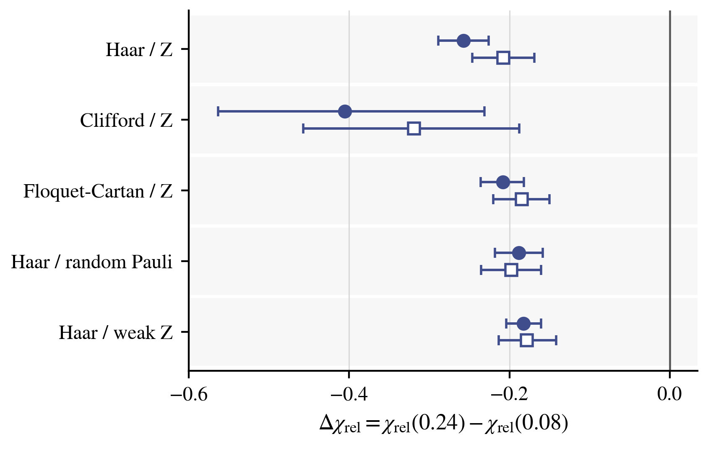
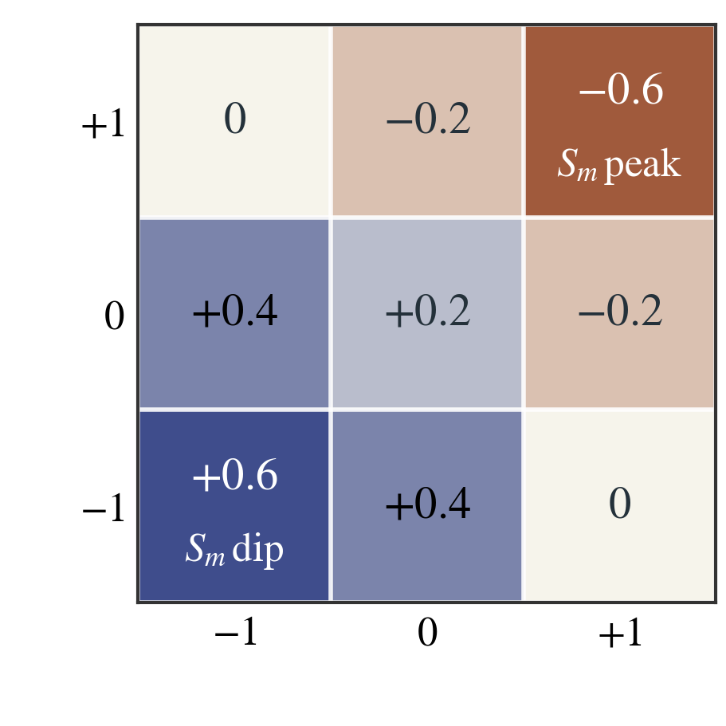
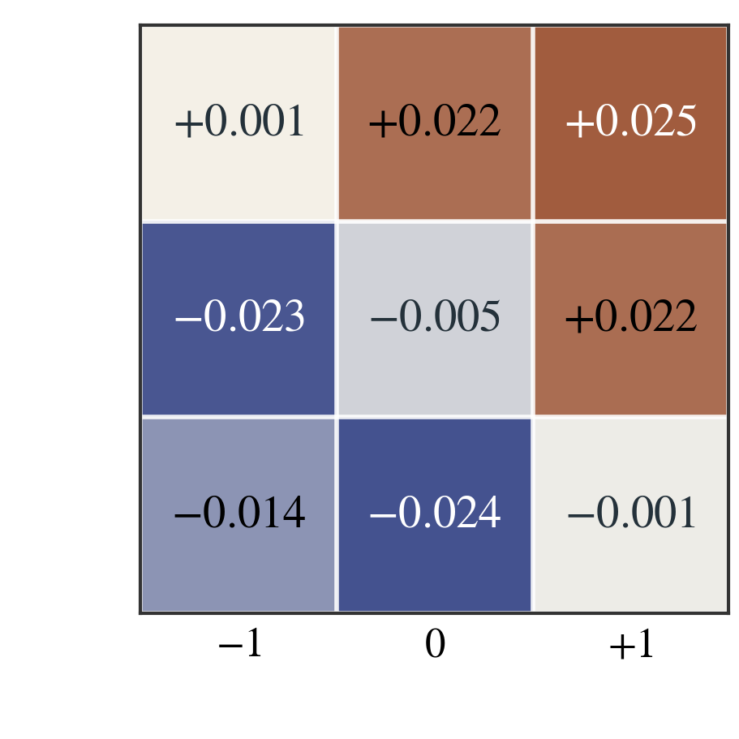
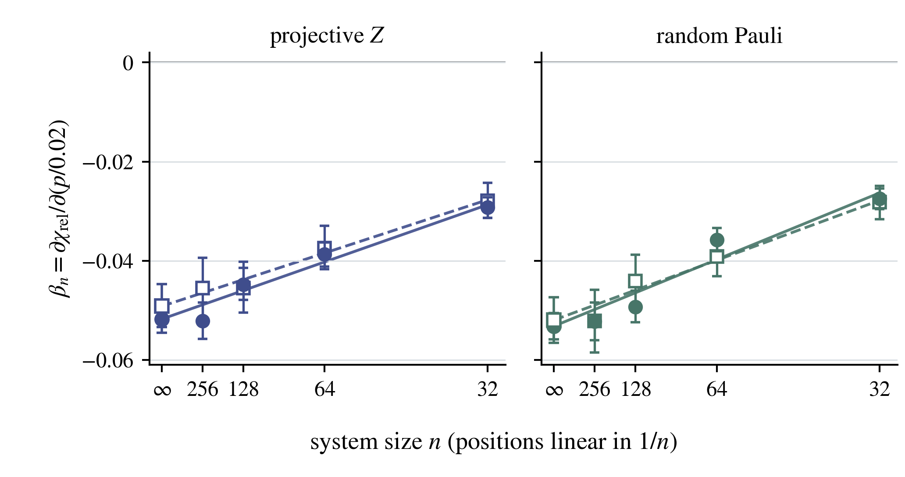
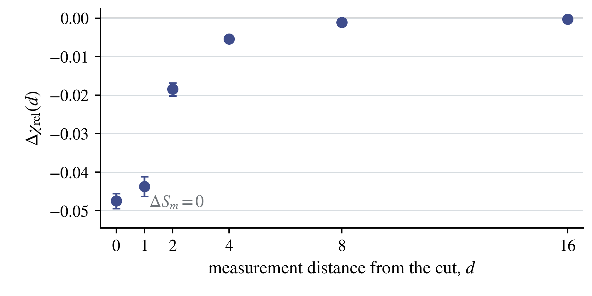
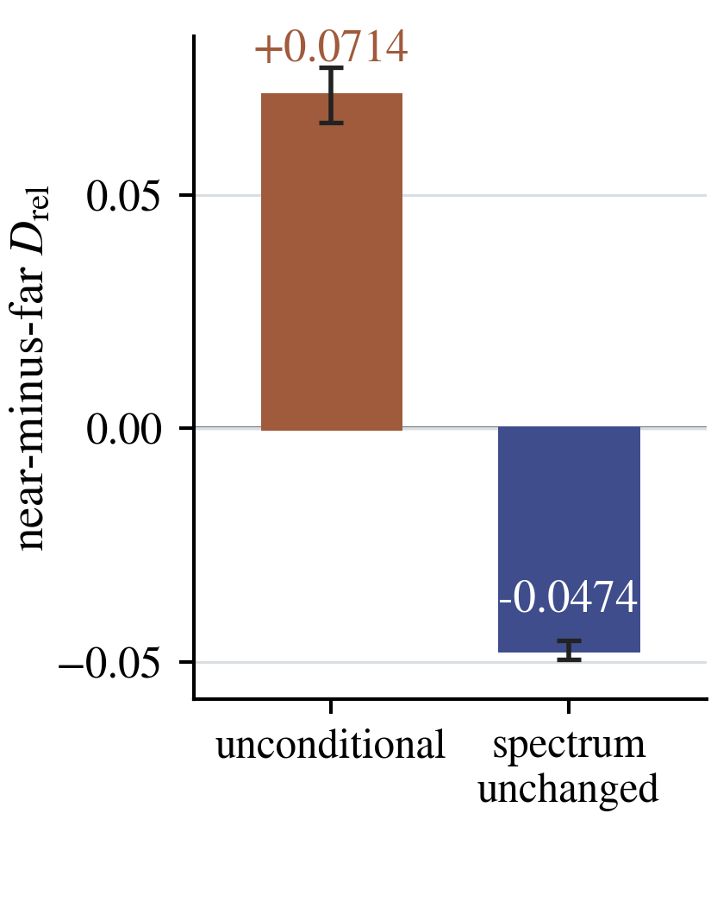

# Irises figure palette: repository preview

**[Project preview](README.md)** · **[Scientific argument](../../docs/DIALOGUE_REPORT.md)** · **[Palette specification](../palette.json)**

The left panel in each comparison is the accepted figure; the right panel is the Irises-inspired proposal. The values, uncertainty intervals, labels, marker geometry, axes and normalization are unchanged. Only the color mapping and contrast-dependent matrix-label colors differ. The original canonical assets remain authoritative.

The palette is inspired by the painting supplied by the author, not by pigment measurements or exact pixel samples. [Painting reference](https://en.wikipedia.org/wiki/Irises_(painting)).

| Role | Color |
|---|---|
| Iris blue | `#3F4D8C` |
| Leaf green | `#477568` |
| Earth contrast | `#A05A3C` |
| Sage accent | `#A6B99A` |
| Ochre accent | `#BD964A` |
| Page background | `#F7F5EC` |

## Figure 1

**Does a response contrast remain after spectrum equalization?**

The ten primary and independent-seed contrasts remain negative. The reference spectrum is shared within each family, size, and time cell, separately for each run. Spectrum replacement is a diagnostic modification, not a physical preparation protocol.

### figure 01 panel b

| Accepted colors | Irises proposal |
|---|---|
|  |  |

[Accepted PDF](../../figures/core/figure_01_panel_b.pdf) · [Proposal PDF](irises/figure_01_panel_b.pdf) · [Proposal SVG](irises/figure_01_panel_b.svg)

Data: [figure_01_panel_b.csv](../../data/processed/core_figures/figure_01_panel_b.csv). [Plotting source](../../scripts/figures/make_figure_01_frozen.py) · [Methods](../../docs/FIGURE1_UNCERTAINTY.md).

## Figure 2

**Which neighboring-cut information determines the average response?**

The first matrix is an exact response alphabet for pure stabilizer inputs. The second shows an observed conditional redistribution of code probabilities. Their weighted reconstruction is an identity and consistency check, not an independent experiment.

### figure 02 response matrix

| Accepted colors | Irises proposal |
|---|---|
|  |  |

[Accepted PDF](../../figures/core/figure_02_response_matrix.pdf) · [Proposal PDF](irises/figure_02_response_matrix.pdf) · [Proposal SVG](irises/figure_02_response_matrix.svg)

### figure 02 redistribution matrix

| Accepted colors | Irises proposal |
|---|---|
|  |  |

[Accepted PDF](../../figures/core/figure_02_redistribution_matrix.pdf) · [Proposal PDF](irises/figure_02_redistribution_matrix.pdf) · [Proposal SVG](irises/figure_02_redistribution_matrix.svg)

Data: [figure_02_boundary_codes.csv](../../data/processed/core_figures/figure_02_boundary_codes.csv). [Plotting source](../../scripts/figures/make_figure_02.py) · [Methods](../../docs/THEORY.md).

## Figure 3

**Does the conditional difference persist through the tested sizes?**

The physical fixed-spectrum coefficients remain negative through 256 qubits and repeat with disjoint seeds. Finite-size points are direct estimates. Lines and infinity points use a specified inverse-size extrapolation, not a rigorous thermodynamic limit.

### figure 03 size scaling

| Accepted colors | Irises proposal |
|---|---|
|  |  |

[Accepted PDF](../../figures/core/figure_03_size_scaling.pdf) · [Proposal PDF](irises/figure_03_size_scaling.pdf) · [Proposal SVG](irises/figure_03_size_scaling.svg)

Data: [figure_03_size_scaling.csv](../../data/processed/core_figures/figure_03_size_scaling.csv). [Plotting source](../../scripts/figures/make_figure_03.py) · [Methods](../../docs/EVIDENCE_REASSESSMENT.md).

## Figure 4

**How does a spectrum-preserving response change depend on location?**

The individual nonpositive change follows from the stabilizer sign corollary. The paired near-minus-far ordering and near-cut concentration are empirical. The profile establishes attenuation over measured distances, not an exponential localization length or a quantitative derivation of the long-run monitoring coefficient.

### figure 04 distance decay

| Accepted colors | Irises proposal |
|---|---|
|  |  |

[Accepted PDF](../../figures/core/figure_04_distance_decay.pdf) · [Proposal PDF](irises/figure_04_distance_decay.pdf) · [Proposal SVG](irises/figure_04_distance_decay.svg)

### figure 04 conditioning contrast

| Accepted colors | Irises proposal |
|---|---|
|  |  |

[Accepted PDF](../../figures/core/figure_04_conditioning_contrast.pdf) · [Proposal PDF](irises/figure_04_conditioning_contrast.pdf) · [Proposal SVG](irises/figure_04_conditioning_contrast.svg)

Data: [figure_04_distance_decay.csv](../../data/processed/core_figures/figure_04_distance_decay.csv), [figure_04_conditioning_contrast.csv](../../data/processed/core_figures/figure_04_conditioning_contrast.csv). [Plotting source](../../scripts/figures/make_figure_04.py) · [Methods](../../docs/EVIDENCE_REASSESSMENT.md).

## What the colors do not mean

Keep the existing marker and line-style distinctions. In Figure 2 the response and redistribution matrices retain opposite palette directions; warm is not a universal code for a negative number. Labels and numeric signs remain essential. Figure 4 retains the zero reference and has no fitted exponential curve.

[Color-only verification](irises/palette_verification.json) compares the recorded non-color artist properties for every panel. It is a bounded presentation check, not a fresh statistical or scientific audit. The website-preview workflow regenerates these candidates and checks their numerical and geometric invariants.
