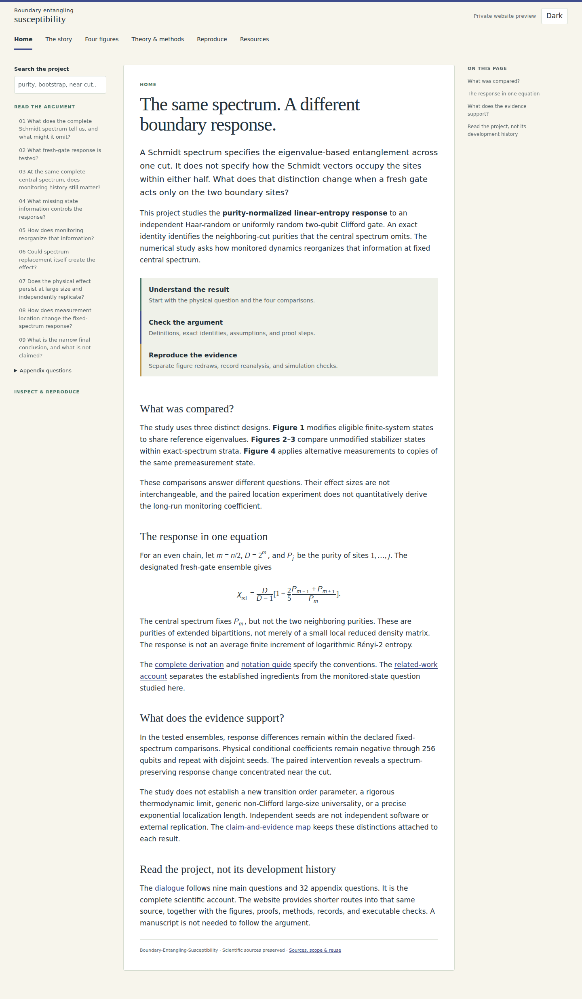
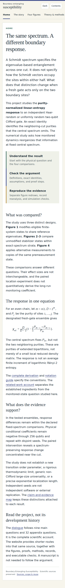
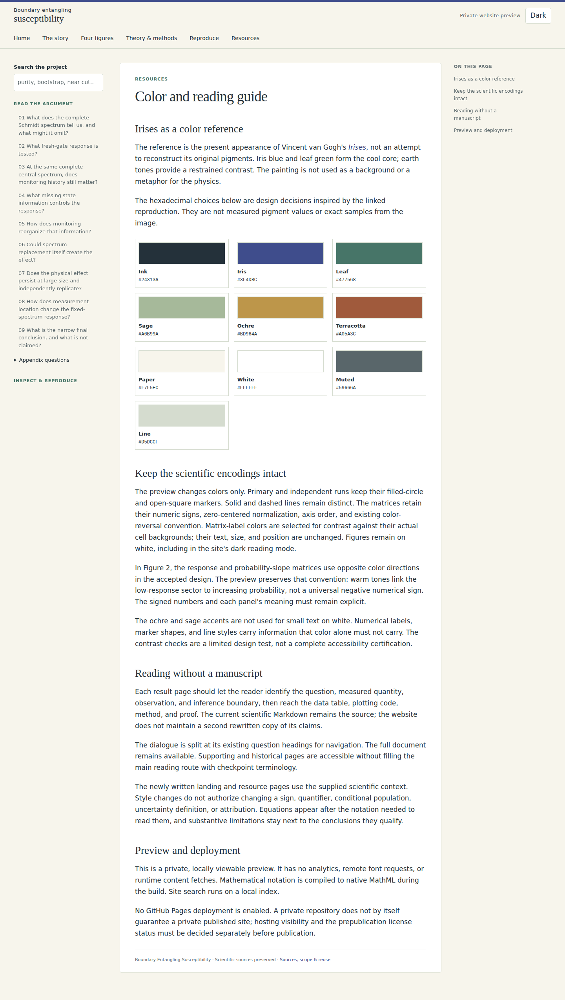

# The same spectrum. A different boundary response.

**[Project home](../../README.md)** · **[The four figures](FIGURES.md)** · **[Read the argument](../../docs/DIALOGUE_REPORT.md)** · **[Theory](../../docs/THEORY.md)** · **[Reproduce](../../docs/REPRODUCTION.md)**

This is the in-repository review entrance for Boundary-Entangling-Susceptibility. Follow the links to read the science and inspect the figures directly on GitHub. The screenshots show the static website's separate desktop and mobile layout; GitHub's Markdown view does not run its custom CSS, search, or theme controls.

## Start with the question

Does the complete central Schmidt spectrum determine the average response to the next fresh gate across that cut? The response considered here also depends on neighboring-cut purities. The empirical question is how monitoring reshapes that additional information at fixed central spectrum.

Read the [short scientific story](../../docs/SCIENTIFIC_STORY.md), then follow the [nine main questions and 32 appendix questions](../../docs/DIALOGUE_QUESTION_MAP.md). The [claim-and-evidence map](../../docs/CLAIM_EVIDENCE_MAP.md) keeps exact deductions, observations, conditional comparisons, and extrapolations distinct.

## Review the reading experience

### Desktop

### Mobile

### The color and reading guide

These screenshots are generated from the tracked site source. They are not a live hosted website. The complete build is checked by the **website-preview** Actions workflow; its artifact contains the HTML, CSS, JavaScript, MathML, figure candidates, and original scientific downloads. No public deployment is enabled.

## Inspect the four-figure argument

| Figure | Question | Read and check |
|---|---|---|
| 1 | Does a response contrast remain after diagnostic central-spectrum equalization? | [Figure and palette](FIGURES.md#figure-1) · [Adopted uncertainty](../../docs/FIGURE1_UNCERTAINTY.md) |
| 2 | What neighboring-cut information controls the averaged response? | [Figure and palette](FIGURES.md#figure-2) · [Exact theory](../../docs/THEORY.md) |
| 3 | Does the physical conditional contrast persist through the tested sizes and independent seeds? | [Figure and palette](FIGURES.md#figure-3) · [Methods](../../docs/NUMERICAL_METHODS.md) |
| 4 | How does a paired measurement's effect depend on its distance from the cut? | [Figure and palette](FIGURES.md#figure-4) · [Pairing and fit limitations](../../docs/EVIDENCE_REASSESSMENT.md) |

The designs have different estimands. Spectrum replacement is diagnostic, physical spectrum matching is conditional, and the location experiment concerns selected paired interventions. The individual spectrum-preserving measurement sign is a stabilizer corollary; its spatial ordering is empirical. No universal non-Clifford limit, new order parameter, or exponential localization length is claimed.

## Sources before manuscript

[Definitions](../../docs/NOTATION.md) · [Proofs](../../docs/THEORY.md) · [Data policy](../../docs/DATA_POLICY.md) · [Code map](../../docs/CODE_MAP.md) · [Related work](../../docs/RELATED_WORK.md) · [Reproducibility limits](../../docs/REPRODUCIBILITY_LIMITS.md)

The manuscript is not drafted here. Two known source-completion items remain: editable sources for the external composite schematics, and incorporation of the recent equation-level entanglement-feature attribution into the authoritative related-work account. This preview does not silently fill either gap.

## Edit the preview

The landing prose is in [website/content](../content/), the visual tokens in [palette.json](../palette.json), the layout in [site.css](../assets/site.css), and the source-derived builder in [build.py](../../scripts/site/build.py). This GitHub review page and its figure gallery are editable Markdown. The canonical scientific documents remain the source of the science, not copies rewritten for the website.

See [build and refresh instructions](../README.md). The Irises figure variants are **presentation candidates**, not replacements for the accepted assets. The repository stays private; public hosting and licensing remain separate decisions.
